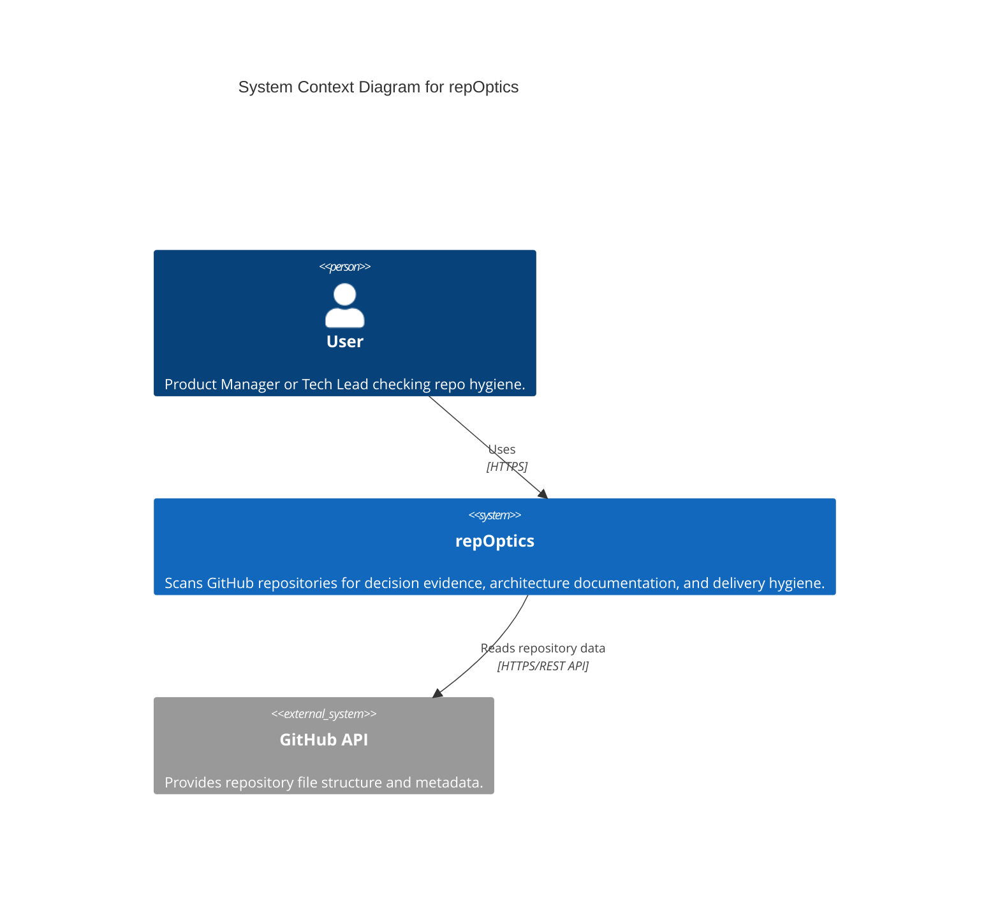
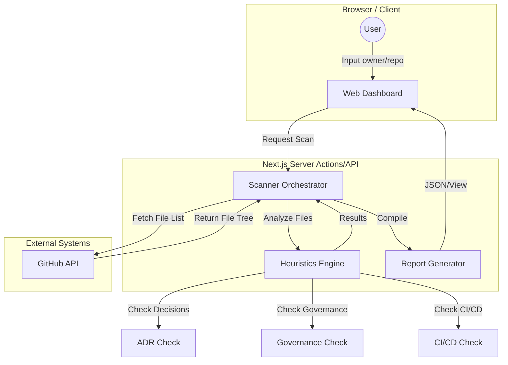

# Architecture

## System Context

This diagram illustrates the high-level context of the **repOptics** system.

## Internal Architecture

This diagram shows the logical components and data flow within the application during a repository scan.

